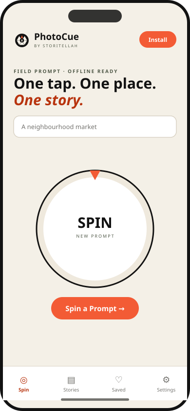
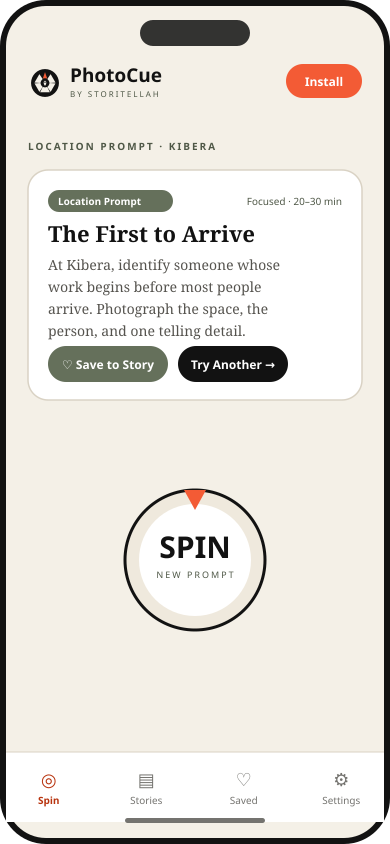
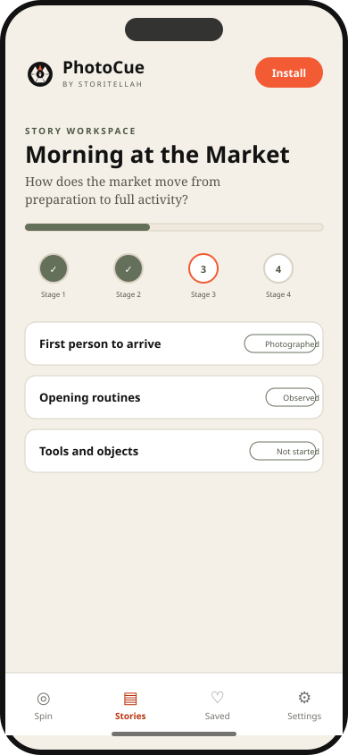
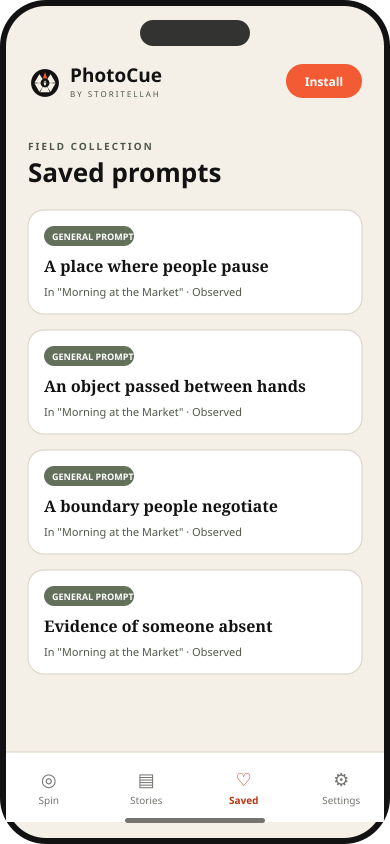
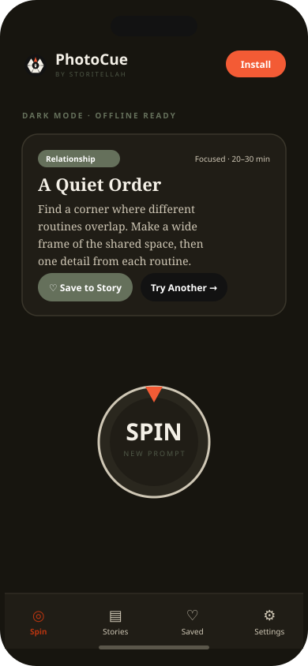

<p align="center">
  
</p>

<h1 align="center">PhotoCue</h1>

<p align="center"><strong>One tap. One place. One story.</strong></p>

<p align="center">One-tap, location-aware photo prompts for documentary photographers, filmmakers, and visual storytellers.<br/>Offline-first, private by default, with optional AI-composed prompts.</p>

<p align="center">
  <a href="https://photocue.pages.dev"><strong>▶ Open the live app</strong></a>
</p>

<p align="center">
  
  
  
  
  
</p>

<p align="center">
  
  
  
</p>

---

## Overview

PhotoCue helps photographers move from isolated images to structured visual
stories. Open the app, tap once, and receive a practical documentary prompt.
Enter a place — a market, a school, a train station, a neighbourhood street —
and prompts become location-aware without ever inventing facts about that place.
Save prompts into a guided **Story Path**, add field notes, and build a complete
photo story from opening image to closing frame.

Everything runs **offline** after the first load. There is **no account**, no
advertising, and no tracking. Your stories, notes, locations, and prompt history
stay on your device. **The spinner is the heart of the app** — tap it and a
practical, documentary-grade prompt appears instantly.

## Features

- **A spinner at the centre** — a photographic command dial you can tap, swipe, or trigger with the spacebar; a satisfying, catchy spin lands a fresh prompt every time.
- **Documentary & cinematic prompts** — vocabulary drawn from film grammar, lenses, light, and the decisive moment. Choose a **prompt style**: Observational, Cinematic, or Poetic.
- **Optional AI generation** — opt in and prompts are composed live by an AI model via a same-origin Cloudflare Function. Off by default; the app stays fully offline and private otherwise, and always falls back to the local engine.
- **General and location-aware prompts** — neutral, observational, never assuming.
- **Installation-specific prompt sequences** — a local anonymous seed means different devices get different prompts.
- **Offline prompt generation** — a compositional engine with hundreds of thousands of combinations, fully local.
- **Story Path mode** — a flexible beginning-to-end story structure that suggests the next useful stage.
- **Prompt history & freshness** — no repeats; each new prompt differs from recent ones in several meaningful ways.
- **Saved stories & field notes** — status tracking, drag-to-reorder, reflection notes.
- **Ethical photography reminders** — practical, non-legal, toggleable.
- **PDF, text, Markdown, JSON & image export** — clean A4/US-Letter story plans.
- **Installable PWA** — custom icons, maskable icons, splash, offline fallback, update prompt.
- **Android and iOS packaging support** — via Capacitor.
- **Workshop mode** — generate a different assignment per participant around a shared theme.
- **No account required** and **privacy-first local storage** — export, import, and delete your data any time.

## Screenshots

<table>
  <tr>
    <td align="center"><br/>Spinner</td>
    <td align="center"><br/>Location prompt</td>
    <td align="center"><br/>Story Path</td>
  </tr>
  <tr>
    <td align="center"><br/>Saved prompts</td>
    <td align="center"><br/>Dark mode</td>
    <td></td>
  </tr>
</table>

## Install PhotoCue

PhotoCue is a Progressive Web App. From a supported browser:

- **Chrome / Edge (Android & desktop):** open the app and choose **Install** in the address bar, or use the in-app **Install PhotoCue** button.
- **Safari (iOS / iPadOS):** tap **Share → Add to Home Screen**.
- **Firefox (Android):** menu → **Install**.

Once installed it launches full-screen, works offline, and prompts you when an
update is available.

## Development

```bash
# Install dependencies
npm install

# Start the dev server
npm run dev

# Run the test suite
npm test

# Type-check
npm run typecheck

# Build the production app
npm run build

# Preview the production build
npm run preview
```

### Regenerating brand assets

```bash
node scripts/generate-logo.mjs        # logo & icon system
node scripts/generate-screenshots.mjs # README screenshots
```

### Native (Capacitor)

```bash
npm run build            # web assets must exist first
npm run android          # generate the Android project
npm run android:apk      # assemble a debug APK
npm run android:bundle   # build a release App Bundle (.aab)
npm run ios              # generate the iOS project (macOS + Xcode)
npm run native:sync      # copy the web build into native projects
```

Android package name and iOS bundle identifier: `com.storitellah.photocue`.

## Deployment

PhotoCue is a static, root-served PWA and runs on any static host.

### Cloudflare Pages (production — [photocue.pages.dev](https://photocue.pages.dev))

| Setting | Value |
| --- | --- |
| Build command | `npm run build` |
| Build output directory | `dist` |
| Node version | `22` (pinned via `.node-version`) |
| Base path | `/` (default — do **not** set `BASE_PATH`) |

The base path is driven by the `BASE_PATH` env var and defaults to `/`, which is
correct for root-served hosts like Cloudflare Pages. Because the app uses hash
routing, no SPA redirect rules are needed.

#### Enabling AI prompts (optional)

The AI feature is served by a Cloudflare Pages Function at
[`functions/api/generate.ts`](functions/api/generate.ts) using **Workers AI** —
no API key required. To turn it on:

1. In the Cloudflare dashboard, open your Pages project → **Settings → Functions → Workers AI bindings**.
2. Add a binding with variable name **`AI`**.
3. Redeploy. Users can then enable **AI prompt generation** in the app's Settings.

If the binding is absent, the function returns a graceful error and the app
falls back to its offline engine — nothing breaks. The request is same-origin,
so the app's strict Content-Security-Policy needs no changes.

### GitHub Pages

A parallel deploy runs via `.github/workflows/pages.yml` on every push to
`main`. That workflow builds with `BASE_PATH=/photocue/` because GitHub Pages
serves from a sub-path.

## Privacy

Stories, notes, locations, and prompt history remain on your device by default.
There is no account and no server. Location is used only to derive an
approximate label — exact coordinates are never stored. You can export a backup,
import one, clear your saved location, or delete all data from **Settings**. See
[PRIVACY.md](PRIVACY.md).

## Contributing

Photographers, storytellers, educators, designers, translators, and developers
are all welcome. See [CONTRIBUTING.md](CONTRIBUTING.md) and our
[Code of Conduct](CODE_OF_CONDUCT.md).

### Prompt contributions

The prompt engine is **compositional** — variety comes from combining modular
vocabulary, not from long lists of fixed sentences. You can contribute by adding:

- **vocabulary** entries to a bank in `src/engine/vocabulary.ts`;
- **templates** (sentence skeletons) in `src/engine/templates.ts`;
- **place types** in `src/data/place-types.ts` and **context tags** in `src/data/context-tags.ts`;
- **ethical guidance** lines;
- **translations** as new dictionaries under `src/i18n/`.

Please **do not** add repetitive, complete pre-written prompts. See
[docs/PROMPT_ENGINE.md](docs/PROMPT_ENGINE.md) for the full guide.

## Roadmap

- Additional languages (Kiswahili, French, Portuguese, Spanish, Arabic, Amharic)
- Expanded Workshop mode and facilitator prompt collections
- Collaborative story planning
- Optional end-to-end encrypted sync
- Custom prompt packs
- Photography assignment exports

## License

Source code is licensed under the [MIT License](LICENSE). The original PhotoCue
prompt library (vocabulary and templates) is additionally licensed under
[CC BY 4.0](LICENSE-CONTENT) so it can be reused and translated with attribution.

## Credits

Created by **Storitellah**.

<p align="center"><em>Designed for documentary photographers and visual storytellers.</em></p>
